# SmartHub-Network-Infrastructure

SmartHUB is an enterprise network infrastructure project designed and simulated in Cisco Packet Tracer.

The project was built to demonstrate the design and implementation of a segmented, redundant, and secure network environment. It integrates
Layer 2 switching, Layer 3 routing, high availability, network security, Internet connectivity, and centralized network services into a single
working topology.

## Network Topology

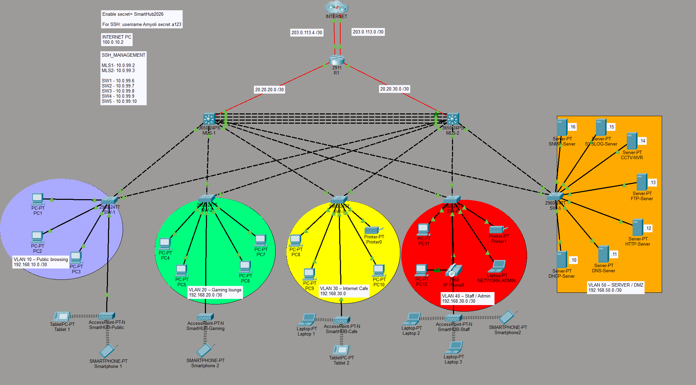

*The network consists of multilayer switches, access switches, an edge router, client networks, and a dedicated server network.*

---

## Technologies Implemented

- VLANs
- Inter-VLAN Routing
- OSPF
- HSRP
- NAT/PAT
- Extended ACLs
- SSH version 2
- NTP
- EtherChannel
- Rapid PVST+
- Port Security
- BPDU Guard
- DHCP
- DNS
- HTTP
- FTP
- Network Management Services

---

## Network Security

The project implements network segmentation and access control using VLANs and extended ACLs. Management access is secured using SSH, while access-layer security includes port security and BPDU Guard.

## Routing and High Availability

OSPF is used for dynamic routing, while HSRP provides gateway redundancy between the multilayer switches.

EtherChannel is used to provide increased bandwidth and link redundancy between network devices.

## Internet Connectivity

NAT/PAT is implemented on the edge router to provide Internet connectivity for internal VLANs.

## Network Services

The server network provides services including:

- DHCP
- DNS
- HTTP
- FTP
- NTP
- Network management services

## Verification and Testing

The implementation was verified using Cisco IOS `show` commands and connectivity tests to confirm routing, NAT, HSRP, ACLs, VLANs, EtherChannel, STP, SSH, and network services.

---
### Routing
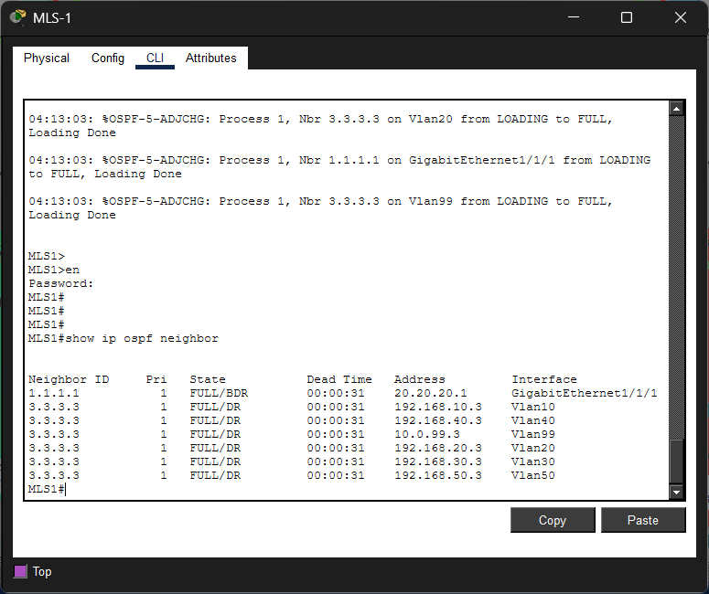

*OSPF neighbor relationships successfully established.*

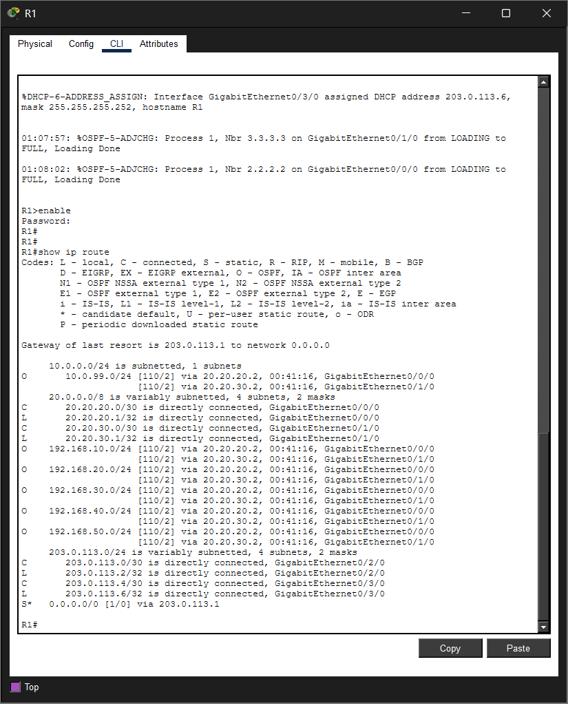

*Expected routes successfully learned*

---

### High Availability
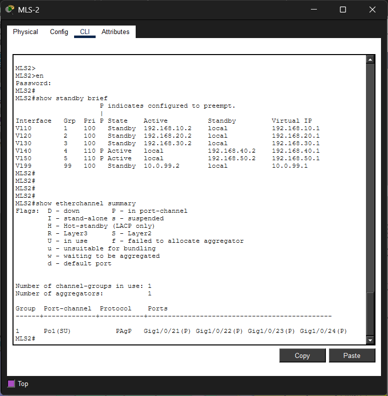

*HSRP active and standby roles successfully established*

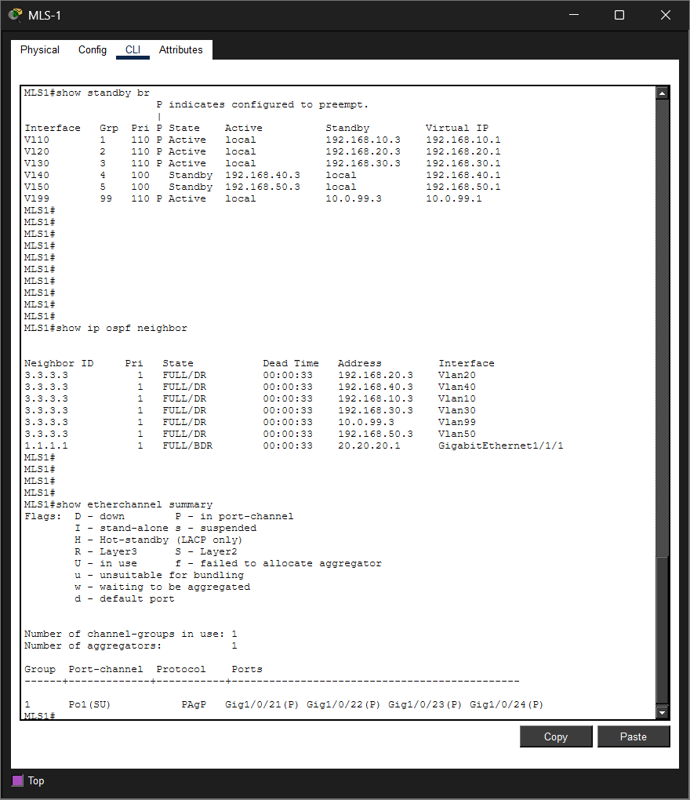

*EtherChannel successfully established and operational*

---

### Switching
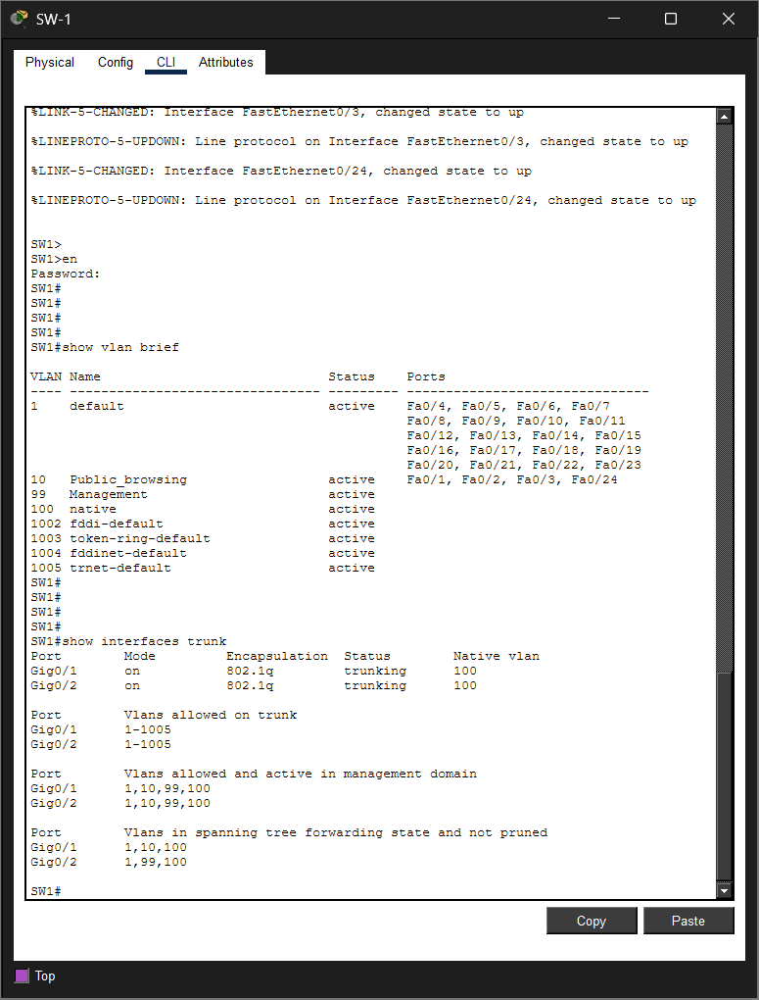

*Required VLANs successfully configured*

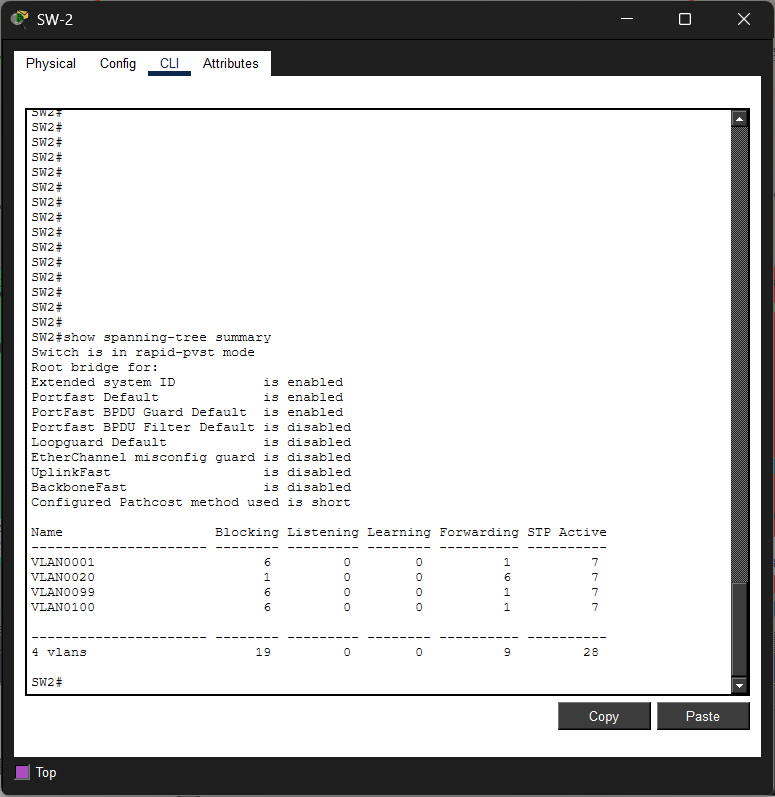

*Rapid PVST+ successfully configured and operational*

---

### Security
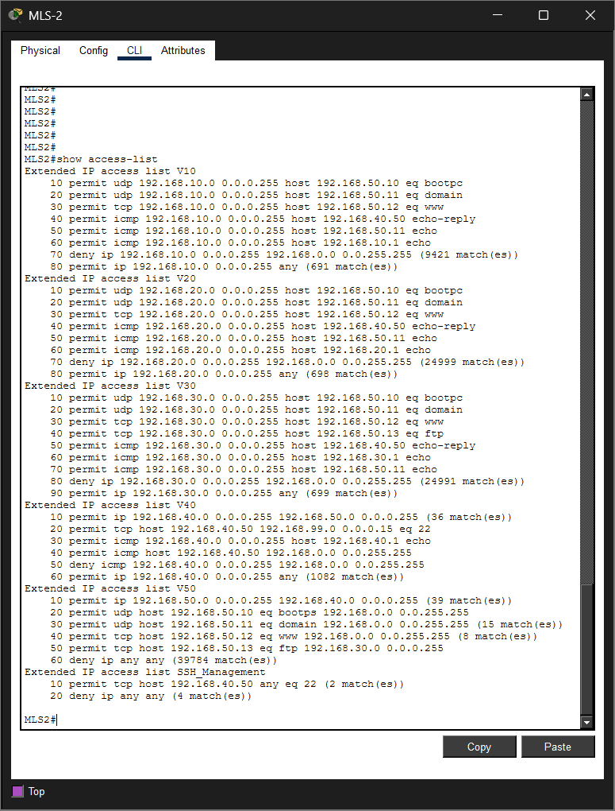

*ACL policies successfully applied and enforced*

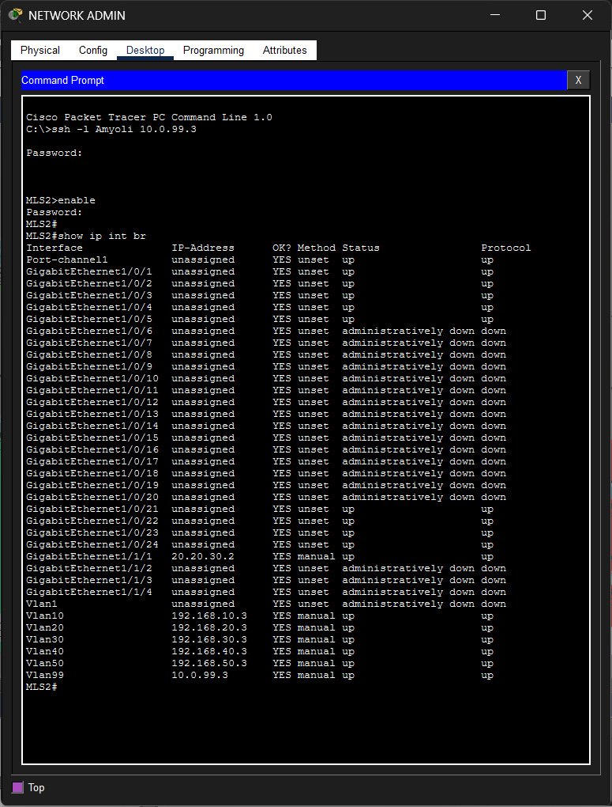

*SSH version 2 successfully enabled*

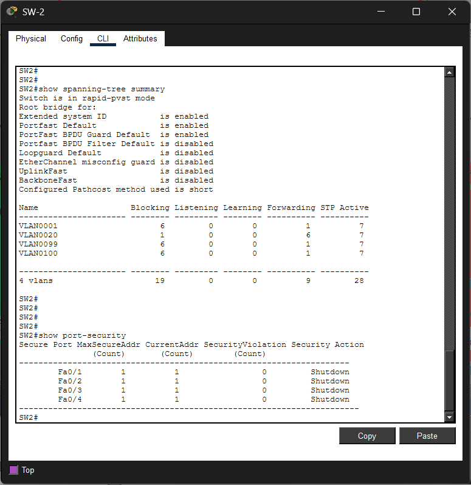

*Port security successfully configured and enforced*

---

### NAT & Internet Connectivity
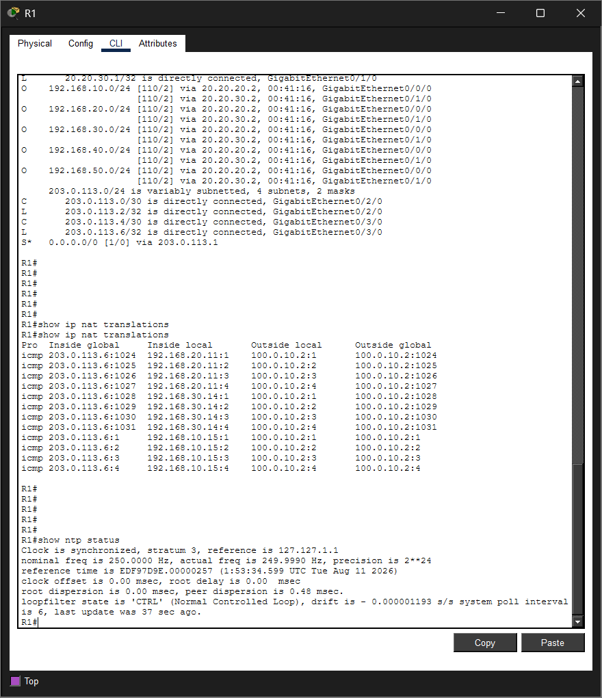

*NAT/PAT translations successfully established*

---

### Network Services
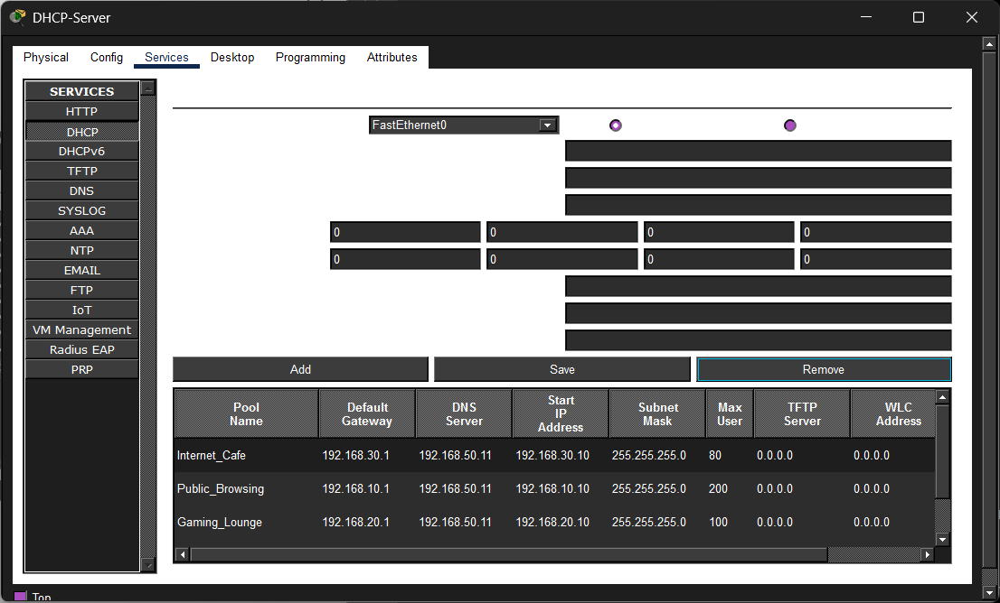

*DHCP address assignment successfully verified*

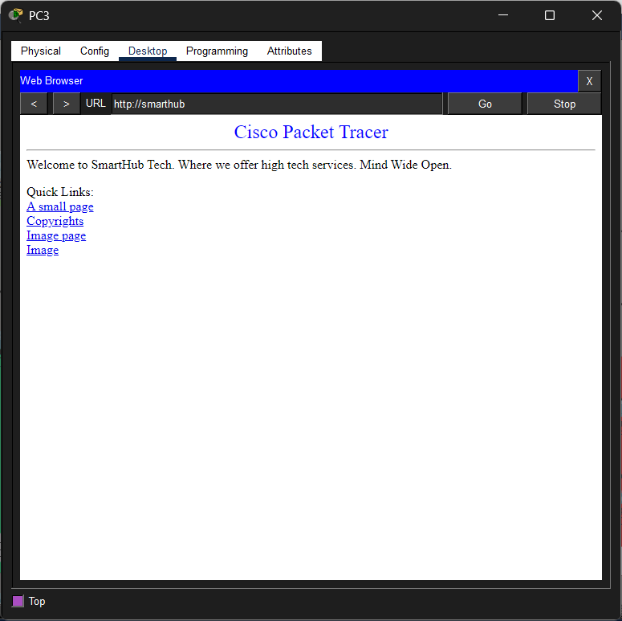

*HTTP service successfully accessed*

---

### Connectivity
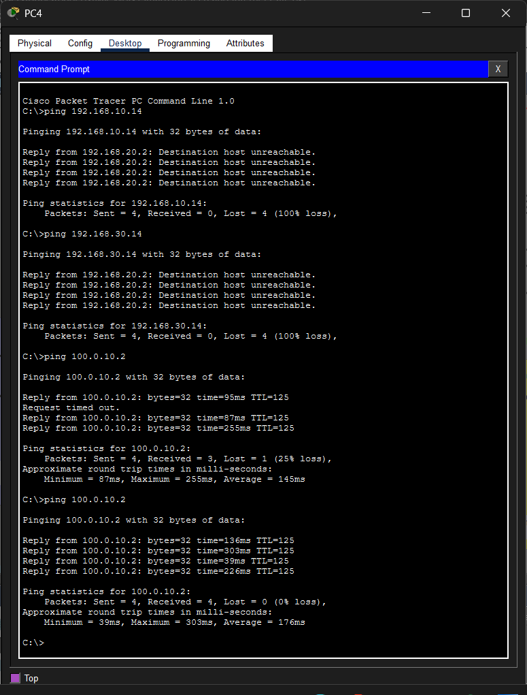
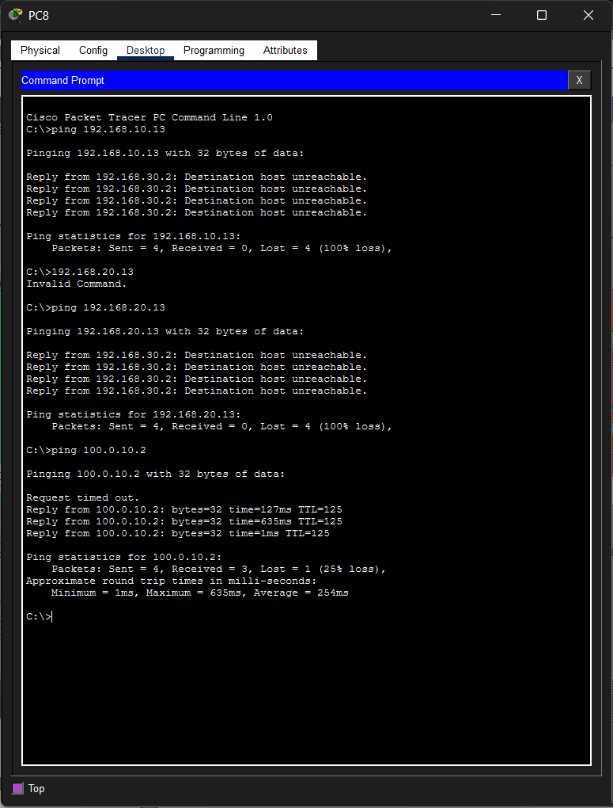

*ACL policies successfully*

---

## Packet Tracer Note

Packet Tracer may drop the following ACL-to-SVI bindings when the `.pkt` file is reopened. If this occurs, reconfigure them on both MLS-1 and MLS-2:

```cisco
interface vlan 10
 ip access-group V10 in

interface vlan 20
 ip access-group V20 in

interface vlan 30
 ip access-group V30 in

interface vlan 40
 ip access-group V40 in

interface vlan 50
 ip access-group V50 in
